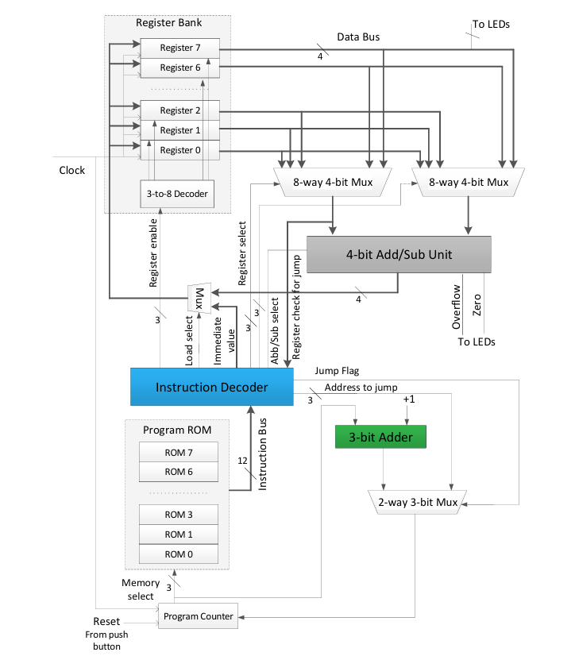
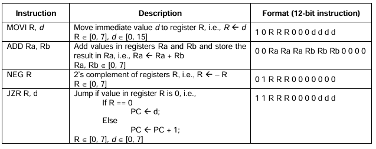

## Nanoprocessor Design using Vivado
# Introduction
This project showcases the design and implementation of a simple nanoprocessor using Xilinx Vivado. The nanoprocessor is capable of executing four basic instructions:

- MOVI: Move an immediate value to a register.
- ADD: Add the values of two registers.
- NEG: Compute the two’s complement (negation) of a register value.
- JZR: Jump to a specified program counter if the zero flag is set.
  
The program to be executed by the nanoprocessor is hardcoded into the ROM. This project demonstrates the fundamental concepts of processor design, including instruction decoding, arithmetic operations, and control flow.

# Features
- Instruction Set: The nanoprocessor supports a minimal instruction set designed for basic arithmetic and control operations.
-Hardcoded Program: The program to be executed is stored in the ROM, showcasing how instructions are fetched and executed.
-Vivado Design Suite: The entire design process, from HDL coding to synthesis and implementation, is carried out using Xilinx Vivado.

## Getting Started
# Prerequisites
- Xilinx Vivado Design Suite
- Basic knowledge of HDL (VHDL/Verilog)
  
# Installation
Clone the repository:
```sh
git clone https://github.com/yourusername/nanoprocessor-vivado.git

cd nanoprocessor-vivado
```

Open the project in Vivado:

vivado -Open project> Lab9.xpr

# Usage
- Synthesize and Implement: Run the synthesis and implementation process in Vivado.
- Program the FPGA: Load the bitstream onto your FPGA board.
- Simulation: Use the provided testbench files to simulate the nanoprocessor’s behavior.


# Block Diagram


# Instruction Flow
Instruction must be hard code into ROM in Vivado -Sources/Design Sources/ProgramROM.vhd. Reffer followin instruction architecture
when hard coding your program.



# Acknowledgments
- Xilinx for providing the Vivado Design Suite.
- Department of Computer Science and Engineering University of Moratuwa for supporting and guiding through this project.
